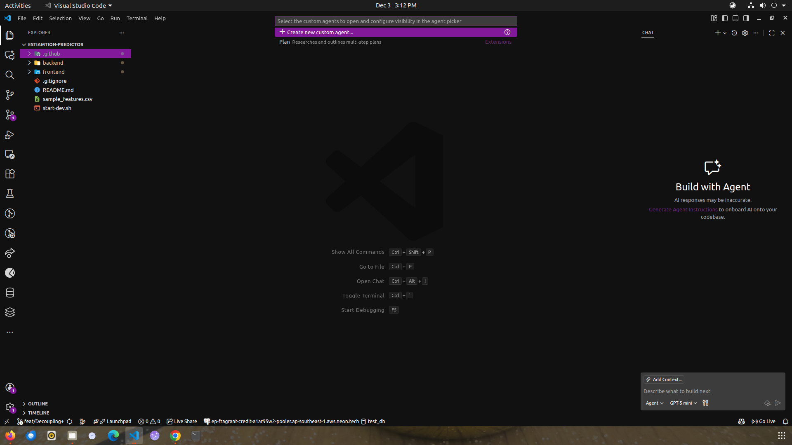
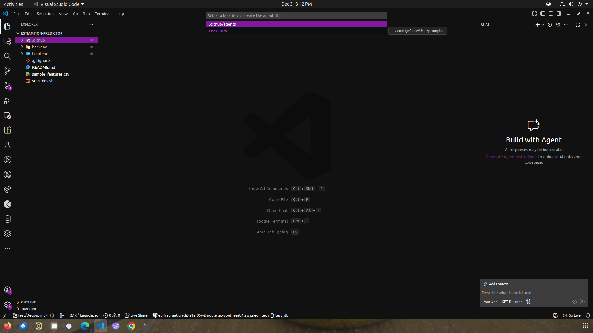

# Prompt-Engineering Agent (Repository)

This repository contains a workspace-level instruction file that customizes the behavior of the Copilot/Chat agent when contributors use the "Prompt-Engineering" agent. The instructions shape how the agent formats outputs, what role it assumes, and what it does (or doesn't do) before receiving confirmation from the user.

This README explains the agent, summarizes the repository-level instructions, and lists steps to configure the behavior both at the workspace (repository) level and at the user level in Visual Studio Code.

## What this agent does

- Role: The agent switches into a "Prompt Engineer" role and focuses on rewriting/optimizing user prompts.
- Output format: The agent produces two sections on every iteration:
  1. Revised/Final Prompt — the rewritten/optimized prompt enclosed in a code block for easy copy/paste.
  2. Clarification Questions — any follow-up questions needed to finish the optimization (or `None` when no questions are needed).
- Flow control: After producing the optimized prompt the agent waits for explicit confirmation from the user before taking any implementation actions.

These rules are codified in the repository file:

- [**`.github/pe.instructions.md`**](./.github/pe.instructions.md) — the file used by the workspace to instruct the agent about the Prompt-Engineering agent (already present in this repo).

## Files to inspect

- [**`.github/pe.instructions.md`**](./.github/pe.instructions.md)
  - Purpose: workspace-level instructions for the chat agent. This file includes the agent behavior and output formatting rules for the Prompt-Engineering agent.

# Configure the Prompt-Engineering agent:

  ## Step's to setup:

  **Note**: Make sure VSCode is updated to latest version in order to use the agent.

  1. Open copilot chat and in the chat window select `Configure Custom Agents` option from mode selection drop-down.
      - once you click on the agent a new modal would appear at the top center.
      

      - From the modal select `Create new custom agent`. Once selected you would be given 2 option: `.github/agents` and `User Data`. From this 2 options select `User Data`.
      
      
      - After Selecting the agent scope, you will be asked to name it `Prompt-Engineering` and a new file will be created.

  2. After the file is created copy the contents from [**Prompt-Engineering.agent.md**](https://github.com/rajtrivedi-simform/Prompt-Engineering-Chatmode/blob/main/.github/agents/Prompt-Engineering.agent.md) from github repository and paste them in the agent file. After saving the custom agent will be visible in the mode selection drop-down of copilot chat.

  3. Add a instructions file named `pe.instructions.md` in the `.github` folder of project and copy the contents of [**pe.instructions.md**](https://github.com/rajtrivedi-simform/Prompt-Engineering-Chatmode/blob/main/.github/pe.instructions.md) from repository and paste them in the file.

  After following above steps you are ready to use the agent.

  **Note's:**

  - During the prompt generation step make sure not to break the flow by editing the answers given to agent. Make sure to answer properly. 
  - At any point you feel the prompt is ready-to-use just prompt the agent with `implement` and it will start it's implementation. 

## Example workflow when using Prompt-Engineering agent

1. Open this repository in VS Code.
2. Start a chat and switch to the "Prompt-Engineering" agent (if supported by your Copilot/Chat UI).
3. The agent will adopt the Prompt Engineer role and return a Revised/Final Prompt (in a code block) plus any Clarification Questions.
4. Review the revised prompt. If it looks good, confirm to the agent to continue or ask it to implement the prompt.

Important: The agent will not perform implementation steps automatically after generating the revised prompt it will wait for explicit confirmation.

## Contributing and modifying the chat instructions

- If you'd like to change the repository-level behavior, edit `.github/pe.instructions.md` and update the instructions.
- Keep changes small and well-documented. Prefer short, deterministic rules (role, required output structure, and interaction controls).

## Further reading and troubleshooting

- If your editor does not appear to respect the repository instructions, verify:
  - You have a recent Copilot/Chat extension installed.
  - The extension supports repository-level instruction files.
  - There are no conflicting workspace or user settings that override the behavior.
- Consult the extension's documentation for how it consumes repo-supplied instruction files.

## Summary

This repo contains a Prompt-Engineering agent instruction file under `.github/`. The file defines a predictable, safe workflow for optimizing prompts: produce a Revised/Final Prompt and Clarification Questions, then wait for user confirmation before implementing. Configure behavior at the workspace level by editing the `.github/` instruction file and at the user level via VS Code Settings (either UI or settings.json), choosing User or Workspace scope as you prefer.

---
